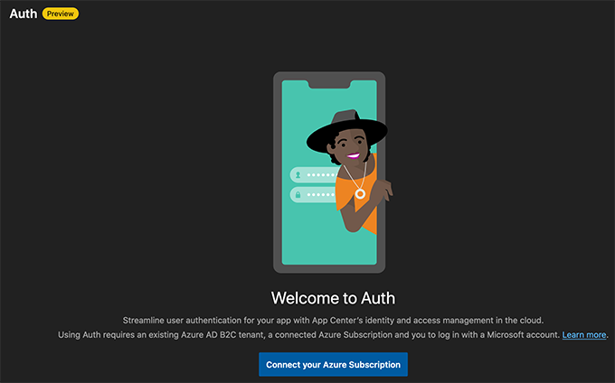
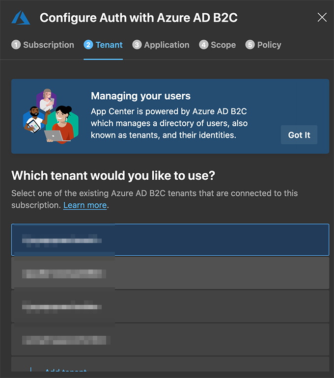
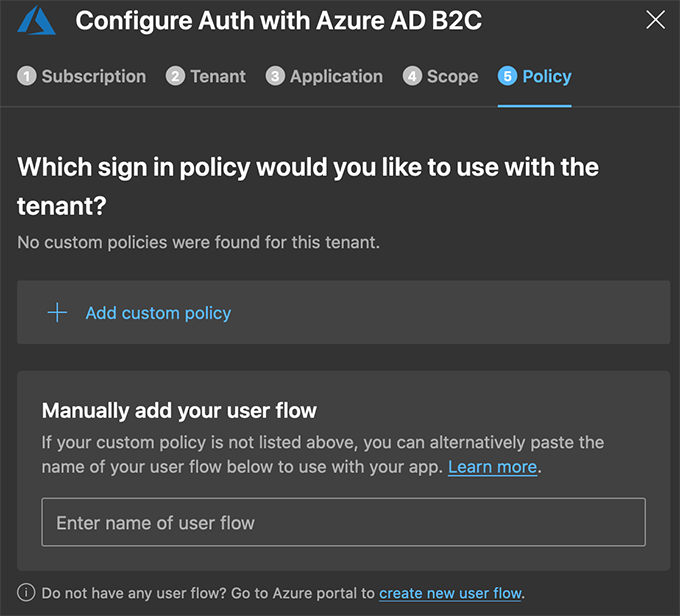

# Azure AD B2C によるログインの実装
ここでは Azure AD B2C と App Center Auth の仕組みを利用して、クライアントアプリへの認証によるログインの実装方法を説明します。

## Azure ポータルでの Azure AD B2C の設定
- Azure AD B2C テナントの作成

*TBD*
## App Center Auth の設定
上記で作成した Azure AD B2C のテナントを App Center に紐付ける作業をおこないます。

- App Center ポータルからアプリケーションを選択
- 左側のメニューから `Auth` をクリック
- `Connect your Azure Subscription` をクリック
- 該当するサブスクリプションを選択して、`Next` をクリック
- 該当するテナントを選択して、`Next` をクリック
- 該当するアプリケーションを選択して、`Next` をクリック
- 該当するスコープを選択して、`Next` をクリック
- ポリシータブでは作成したユーザーフローを**入力**して、`Connect` をクリック








*TBD*
## クライアントアプリへ App Center Auth を追加する（共通）
- `Microsoft.AppCenter.Auth` パッケージを追加します（共通, iOS, Android）。
- `App.xaml.cs` に `typeof(Auth)` を追加します。
```diff
+ using Microsoft.AppCenter.Auth;
...
  AppCenter.Start($"android={Constant.AppCenterKeyAndroid};"
  　　+ "uwp={Your UWP App secret here};"
  　　+ $"ios={Constant.AppCenterKeyiOS}",
-  　　typeof(Push));
+  　　typeof(Push),typeof(Auth));
```

## クライアントアプリへの実装（iOS）
- `info.plist` へ下記を追加します。`VSCode` などのエディタなどを使用すると編集しやすいです。`{Your App Secret}` は `App Center` → アプリケーション → 概要（Overview）→ Xamarin.Forms にあるキーをコピペします。 

info.plist

```xml
<key>CFBundleURLTypes</key>
<array>
    <dict>
        <key>CFBundleTypeRole</key>
        <string>Editor</string>
        <key>CFBundleURLName</key>
        <string>$(PRODUCT_BUNDLE_IDENTIFIER)</string>
        <key>CFBundleURLSchemes</key>
        <array>
            <string>msal{Your AppCenter Key}</string>
        </array>
    </dict>
</array>
```

- Visual Studio For Mac から Entitlements.plist をクリックして以下をおこないます
  - 「Key Chain を有効にする」をチェック
  - +をクリックして、`com.microsoft.adalcache` 追加


## クライアントアプリへの実装（Android）
- `AndroidManifest.xml` の `<application>` タグ内に以下を追加します。`{Your App Secret}` は `App Center` → アプリケーション → 概要（Overview）→ Xamarin.Forms にあるキーをコピペします。 

Properties/AndroidManifest.xml
```xml
<activity android:name="com.microsoft.identity.client.BrowserTabActivity">
    <intent-filter>
    <action android:name="android.intent.action.VIEW" />
    <category android:name="android.intent.category.DEFAULT" />
    <category android:name="android.intent.category.BROWSABLE" />
    <data
        android:host="auth"
        android:scheme="msal{Your App Secret}" />
    </intent-filter>
</activity>
```

## クライアントアプリへのログイン／ログアウトの実装
- `App.xaml.cs` にログインとログアウトを実装します

App.xaml.cs

```diff
  public partial class App : Application
  {
    public string CartId { get; set; }
    public string BoxId { get; set; }
+   public UserInformation UserInfo { get; set;}
...
+ ///
+ /// サインイン
+ ///
+ public async Task<bool> SignInAsync()
+ {
+     try
+     {
+         this.UserInfo = await Auth.SignInAsync();
+         string accountId = this.UserInfo.AccountId;
+     }
+     catch (Exception e)
+     {
+         return false;
+     }
+     return true;
+ }
+ ///
+ /// サインアウト
+ ///
+ public void SignOut()
+ {
+     Auth.SignOut();
+     this.UserInfo = null;
+ }

```

- `LoginPage.xaml` にログインボタンを追加します

LoginPage.xaml
```diff
...
  <Button Margin="0,10,0,0"
          x:Name="btnStartShopping"
          Clicked="LoginClicked"
          Text="買い物を開始します" />
+ <Button x:Name="btnLoginLogout"
+         Text="ログイン" />
```

- `LoginPage.xaml.cs` にログインボタンをクリックしたら上記のログインを呼び出します

```diff
...
  public LoginPage()
  {
    InitializeComponent();

    loadingIndicator.IsRunning = false;
    loadingIndicator.IsVisible = false;
    edtBoxName.Text = "SmartBox1";
+   btnStartShopping.IsEnabled = false;
+
+   // クリックしたときに認証画面へ遷移する
+   btnLoginLogout.Clicked += async (sender, e) =>
+   {
+       if (btnLoginLogout.Text == "ログアウト")
+       {
+           await SignOut();
+       }
+       else
+       {
+           var app = Application.Current as App;
+           if (await app.SignInAsync() != true)
+           {
+               await DisplayAlert("ログインできませんでした", "","OK");
+           }
+           else
+           {
+               await DisplayAlert("ログインしました", "", "OK");
+               btnLoginLogout.Text = "ログアウト";
+               btnStartShopping.IsEnabled = true;
+           }
+       }
+   };
+   async Task SignOut()
+   {
+     var app = Application.Current as App;
+     app.SignOut();
+     btnLoginLogout.Text = "ログイン";
+     btnStartShopping.IsEnabled = false;
+     await DisplayAlert("ログアウトしました", "", "OK");
+   }
...
```
